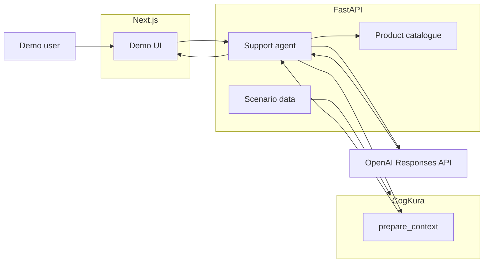

# CogKura Demo

**CogKura Demo shows an AI e-commerce assistant using cognitive memory to understand a customer without sending their complete historical record to the LLM on every request.**

This repository is a public interactive demonstration of [CogKura](https://github.com/cogkura/cogkura) as the memory layer for an AI application. The first scenario models a shopping and support assistant for fictional retailer **Northstar Outfitters** and customer **Alex Morgan**.

## What it demonstrates

```text
customer history → ObservationInput → CogKura → prepare_context() → MemoryContext → AI agent → personalised answer
```

- Persistent customer knowledge across many historical events
- Relevant recall via bounded working memory (not full history in every prompt)
- Explainability: inspect which memories CogKura selected
- Honest token comparison between full-history estimate and CogKura memory context

For systematic evaluation and regression measurement, see [CogKuraBench](https://github.com/cogkura/cogkura-bench).

## Architecture



CogKura runs entirely in the Python backend. The OpenAI API key never reaches Next.js.

## Quick start

```bash
cp .env.example .env
# Set OPENAI_API_KEY and OPENAI_MODEL in .env (optional for memory inspection)

uv sync --project apps/api --dev --locked
npm ci --prefix apps/web

make dev
```

- API: http://localhost:8000
- Web: http://localhost:3000

Run the API with a single worker (`--workers 1`). In-memory CogKura state is process-local.

## Try this prompt

> I'm looking for a waterproof jacket for a hiking trip to Scotland next month. What would you recommend?

Click **Run example** in the UI, or type your own message.

## Verification

```bash
./scripts/verify.sh
```

## Links

- [CogKura](https://github.com/cogkura/cogkura)
- [CogKuraBench](https://github.com/cogkura/cogkura-bench)
- [cogkura.com](https://cogkura.com)

## License

Apache-2.0. See [LICENSE](LICENSE).
