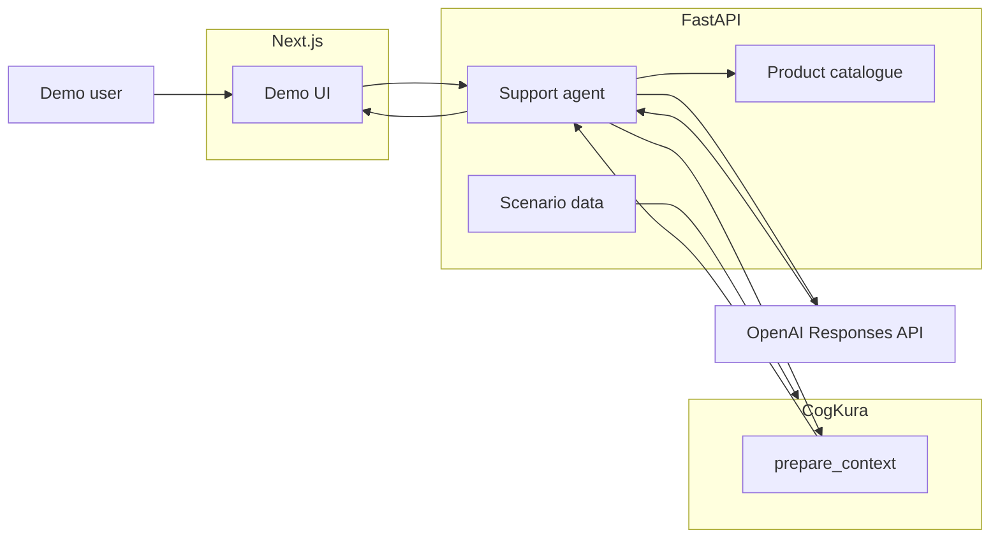

# CogKura Demo

**CogKura Demo shows an AI e-commerce assistant using cognitive memory to understand a customer without sending their complete historical record to the LLM on every request.**

This repository is a public interactive demonstration of [CogKura](https://github.com/cogkura/cogkura) as the memory layer for an AI application. The first scenario models a shopping and support assistant for fictional retailer **Northstar Outfitters** and customer **Alex Morgan**.

## What it demonstrates

```text
customer history → ObservationInput → CogKura → prepare_context() → MemoryContext → AI agent → personalised answer
```

- Persistent customer knowledge across many historical events
- Relevant recall via bounded working memory (not full history in every prompt)
- Explainability: inspect which memories CogKura selected
- Honest token comparison between full-history estimate and CogKura memory context
- **0.2.0:** live memory mutations (size update), purchase/return simulation, HELPFUL/UNHELPFUL learning diagnostics
- **0.3.0:** read-only **Compare** view — same question through Full History, Search (BM25), and CogKura with deterministic labelled-coverage metrics
- **0.3.1:** hardened comparison evaluation — expanded evidence, current/stale semantic identity, BM25 budget diagnostics, genuinely read-only Compare
- **0.3.2:** fixture normalisation — `activity_interest` and `product_fit_issue` cardinality corrected; CogKura miss confirmed for bench handoff
- **0.3.3:** CogKura `0.15.1` — seed history uses evidence chronology and currently falls below the retrieval threshold (0 labelled coverage / 0 context tokens); learning is skipped when the turn context has no selected memories
- **0.3.4:** CogKura `0.15.2` — lexical semantic slot admission restores current jacket size in seed context (1/5 labelled coverage); remaining misses stay a CogKura finding
- **0.3.5:** CogKura `0.15.3` — evidence-chronology cardinality-one reconciliation and evidence-linked semantic recall; live size update surfaces contested M/L overlap
- **0.3.6:** CogKura `0.15.4` — current-at-snapshot admission recovers hiking interest and colour preference (3/5 labelled coverage); lightweight and NorthPeak fit remain missing
- **0.3.7:** CogKura `0.15.5` — canonical retrieval features; Compare 2/5 (size M + colour); hiking collapses against skiing, lightweight and NorthPeak still miss
- **0.3.8:** CogKura `0.15.6` — cardinality-aware recall restores hiking beside colour and size M (3/5); lightweight and NorthPeak still miss; skiing episode remains stale in context
- **0.3.9:** CogKura `0.15.7` — entity-indexed association hops; Compare coverage unchanged at 3/5 (association paths unused on this query); lightweight and NorthPeak still miss
- **0.3.10:** CogKura `0.15.8` — structured entity-relationship hops; Compare coverage unchanged at 3/5 (`relationship_seed_count=0` because the demo does not emit relationship metadata)
- **0.3.11:** retailer catalogue `is_a` taxonomy seeded via public CogKura API; NorthPeak fit and lightweight preference now **recalled** via `structured_relation` paths but still **not selected** (3/5 labelled coverage; WM bottleneck at `max_items=8`)
- **0.3.12:** CogKura `0.15.10` — working-memory chunking with Live Memory restored (size update, short cue, post-size flows); Compare 5/5 at 6 chunks / 135 tokens; contested M/L remains a separate semantic-state finding
- **0.3.13:** evidence-aware semantic ingestion — isolated browse stays episodic; durable `activity_interest` requires stronger/explicit evidence; Compare 5/5 at 5 chunks / 89 tokens without a skiing semantic

For systematic evaluation and regression measurement, see [CogKuraBench](https://github.com/cogkura/cogkura-bench). Compare relevance metrics in this demo are illustrative and application-defined until captured in a benchmark run.

## 0.2.0 live flow

1. Run the example jacket prompt (or inspect-only without an API key).
2. Click **Update size** to reconsolidate `jacket_size` in the same turn.
3. Use **Simulate customer outcome** to purchase (HELPFUL) or return (UNHELPFUL).
4. Watch memory changes, learning counters, and live timeline entries update.

See [docs/design-cogkura-demo-0.2.0.md](docs/design-cogkura-demo-0.2.0.md) for validity-window and consolidator decisions.

## 0.3.0 Compare

Use the **Compare** tab to run the same customer question through three memory strategies without mutating session state:

1. **Full History** — every event, chronological, unbounded
2. **Search (BM25)** — lexical retrieval within a 750-token budget
3. **CogKura** — bounded working memory via `prepare_context()`

The summary table shows tokens, units, **labelled coverage**, and stale concepts. Labelled coverage measures application-defined source evidence for customer concepts; unclassified context may still be useful — the demo does not use an LLM judge. Search exposes whether its token budget or event safety cap constrained retrieval. Compare is read-only and does not reinforce CogKura memories (`record_context_use` is not called). Optional model answers use the same prompt for all three strategies; only `customer_context` changes.

After a live size update in **Live Memory**, run the same jacket prompt in **Compare** to see how Full History retains both medium and large evidence while evaluation marks the older size as stale.

See [docs/design-cogkura-demo-0.3.0.md](docs/design-cogkura-demo-0.3.0.md) for fairness constraints, [docs/design-cogkura-demo-0.3.1.md](docs/design-cogkura-demo-0.3.1.md) for evaluation hardening, [docs/design-cogkura-demo-0.3.13.md](docs/design-cogkura-demo-0.3.13.md) for evidence-aware semantic ingestion, and [docs/findings-customer-decision-context.md](docs/findings-customer-decision-context.md) for the comparison handoff.

## Architecture



CogKura runs entirely in the Python backend. The OpenAI API key never reaches Next.js.

## Quick start

```bash
cp .env.example .env
# Set OPENAI_API_KEY and OPENAI_MODEL in .env (optional for memory inspection)

uv sync --project apps/api --dev --locked
npm ci --prefix apps/web

make dev
```

- API: http://localhost:8000
- Web: http://localhost:3000

Run the API with a single worker (`--workers 1`). In-memory CogKura state is process-local.

## Try this prompt

> I'm looking for a waterproof jacket for a hiking trip to Scotland next month. What would you recommend?

Click **Run example** in the UI, or type your own message.

## Verification

```bash
./scripts/verify.sh
```

## Links

- [CogKura](https://github.com/cogkura/cogkura)
- [CogKuraBench](https://github.com/cogkura/cogkura-bench)
- [cogkura.com](https://cogkura.com)

## License

Apache-2.0. See [LICENSE](LICENSE).
